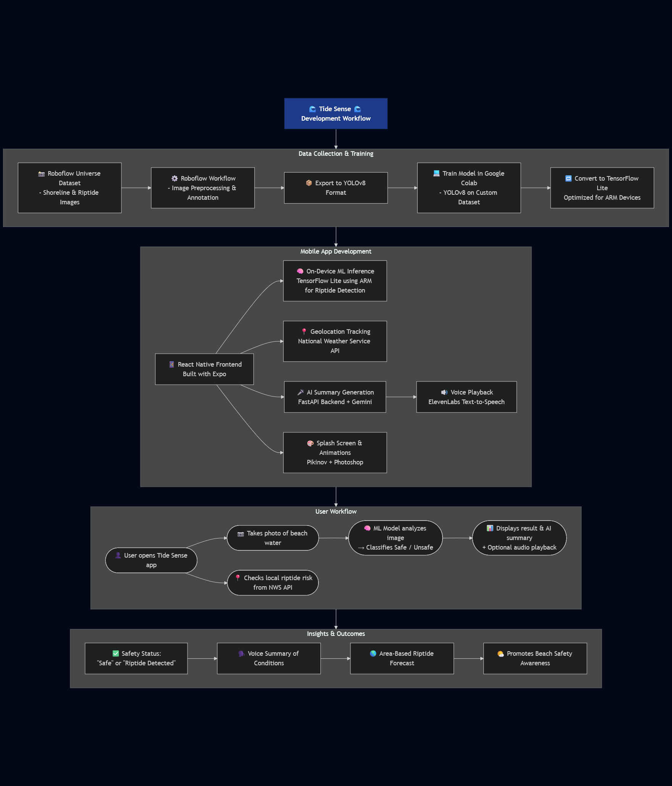

# 🌊 Tide Sense 🌊

Tide Sense is a **riptide detection tool** designed to enhance beach safety using **Computer Vision**.

Users can simply snap a photo of the water, and our app will instantly analyze it for dangerous riptides. Beyond individual safety, our platform is built with features for city planners and designed for future scalability.

Learn more about the project in our Devpost below.

## Developed by: Chris Ho, Nicole Bustos, Stevin George, and Sebastian Noel

**SharkByte Devpost:** https://devpost.com/software/riptide-wip

